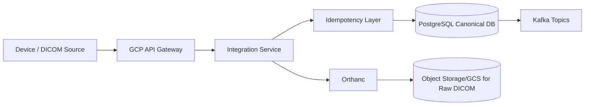

# Logical Architecture (L1/L2)

## Topic strategy
- `device-events` partition key: `device_id`
- `dicom-events` partition key: `study_instance_uid`
- `canonical-data` partition key: `patient_id`
- `dlq` partition key: `correlation_id`
